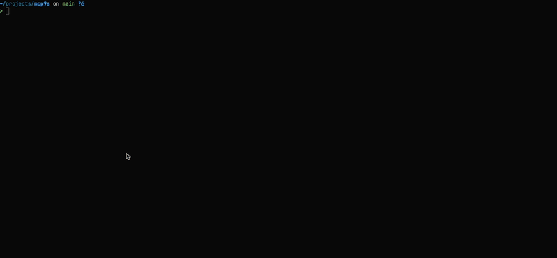

# mcp9s

<p align="center">
  
</p>

A [k9s](https://k9scli.io/)-inspired terminal UI for discovering and interacting with [MCP](https://modelcontextprotocol.io/) (Model Context Protocol) servers.

mcp9s automatically discovers remote MCP servers from all popular AI coding clients installed on your system, shows their live status, and lets you browse tools, generate curl requests, and execute them — all from the terminal.


## Features

- **Auto-discovery** — Scans 18+ MCP client configs to find remote servers
- **Live status** — Probes servers with a real MCP handshake every 2 seconds
- **Tool browser** — Lists all tools exposed by a server with their parameters
- **Curl generation** — Builds ready-to-run curl commands for any tool call
- **Execute in-app** — Run the generated curl and view the response inline
- **JSON highlighting** — Syntax-highlighted, scrollable response viewer
- **Deduplication** — Servers shared across clients are merged, showing all clients
- **Regex filter** — Filter servers by name, URL, or client

## Supported Clients

| Client | Config Path |
|---|---|
| Claude Code | `~/.claude.json` |
| Cursor | `~/.cursor/mcp.json` |
| VSCode | `~/Library/Application Support/Code/User/mcp.json` |
| VSCode Insiders | `~/Library/Application Support/Code - Insiders/User/mcp.json` |
| Windsurf | `~/.codeium/windsurf/mcp_config.json` |
| Windsurf JetBrains | `~/.codeium/mcp_config.json` |
| Kiro | `~/.kiro/settings/mcp.json` |
| LM Studio | `~/.lmstudio/mcp.json` |
| Gemini CLI | `~/.gemini/settings.json` |
| Roo Code | `~/.roo/mcp.json` |
| Cline | `~/.cline/mcp_settings.json` |
| Trae | `~/.trae/mcp.json` |
| Antigravity | `~/.antigravity/mcp.json` |
| OpenCode | `~/.opencode/mcp.json` |
| Zed | `~/.config/zed/settings.json` |
| Amp CLI | `~/.amp/settings.json` |
| Goose | `~/.config/goose/config.yaml` |
| Continue | `~/.continue/config.yaml` |

Only remote (HTTP/SSE) servers are shown. Local stdio servers are skipped.

## Prerequisites

- [Go](https://go.dev/) 1.24+
- [Task](https://taskfile.dev/) (optional, for build commands)

## Installation

### go install

```sh
go install github.com/chrisjburns/mcp9s/cmd/mcp9s@latest
```

This places the `mcp9s` binary in your `$GOPATH/bin` (or `$HOME/go/bin` by default).

### Build from source

```sh
task build
```

Or without Task:

```sh
go build -o bin/mcp9s ./cmd/mcp9s/
```

### Run

```sh
task run
```

Or directly:

```sh
./bin/mcp9s
```

## Key Bindings

### Server List

| Key | Action |
|---|---|
| `↑`/`k` | Move up |
| `↓`/`j` | Move down |
| `g` | Jump to top |
| `G` | Jump to bottom |
| `d` / `Enter` | View server details |
| `/` | Filter servers |
| `:` | Command mode |
| `?` | Help |
| `q` | Quit |

### Detail View

| Key | Action |
|---|---|
| `↑`/`k` | Move up (tools list) |
| `↓`/`j` | Move down (tools list) |
| `Enter` | Open tool dialog (fill params, generate curl) |
| `e` | Execute curl request |
| `c` | Copy curl to clipboard |
| `[`/`]` | Scroll response |
| `Esc` | Back to server list |
| `q` | Back to server list |

## Project Structure

```
cmd/mcp9s/          Entry point
internal/
  config/           MCP client config discovery and parsing
  mcpclient/        MCP protocol operations (tool fetching, curl building)
  tui/              Bubbletea TUI (model, update, view, keys, styles)
```

## License

MIT
